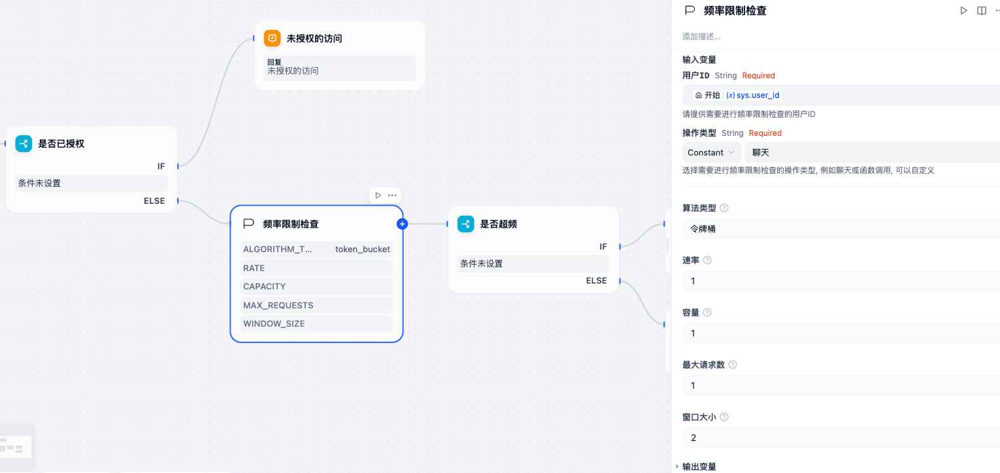
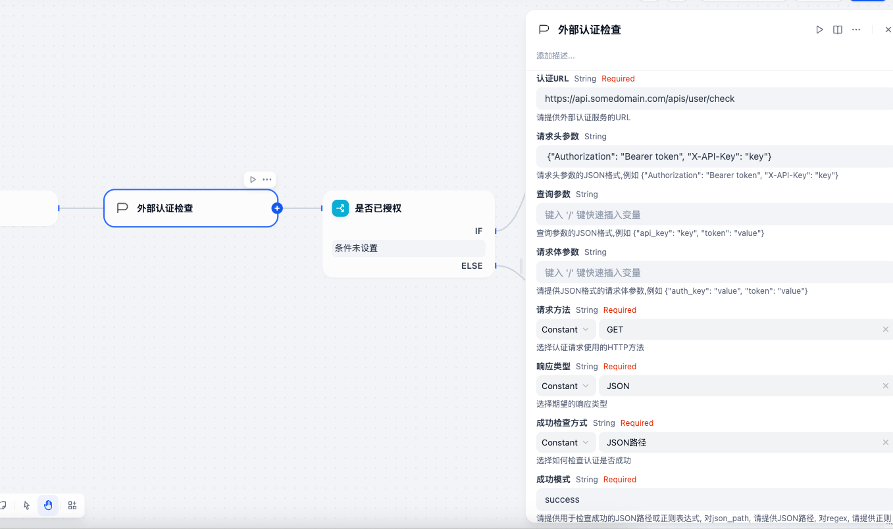

# Safety Chat Plugin

A powerful Dify plugin that provides comprehensive safety and access control features for your applications.

## Features

### Rate Limiting
- Multiple rate limiting algorithms:
  - Token Bucket Algorithm
  - Fixed Window Algorithm
  - Sliding Window Algorithm
  - Leaky Bucket Algorithm
  - Multiple Buckets Limitation

### Storage Options
- Flexible storage backends:
  - Redis Storage
  - Dify Plugin Built-in Storage

### User Authentication
- Multi-dimensional user identification:
  - User ID
  - Operation Type
  - Custom Parameters

## Installation & Develop

1. Clone the repository:
```bash
git clone https://github.com/axdlee/safety-chat.git
```

2. Install dependencies:
```bash
pip install -r requirements.txt
```

3. Configure your environment:
```bash
cp .env.example .env
# Edit .env with your configuration
```

## Usage

### Step 1: Install the Plugin
Install the Safety Chat plugin in your Dify application through the plugin marketplace.

### Step 2: Configure the Plugin
Configure the plugin settings in your Dify application.


### Step 3: Set Up Rate Limiting
Configure your preferred rate limiting algorithm and parameters.




### Step 4: Configure External Authentication


### Step 5: Define Access Rules
Create and manage your access control rules based on your requirements.

## Configuration

The plugin can be configured through the following methods:
- Environment variables
- Configuration file
- Dify plugin settings

## License

MIT License

## Contributing

Contributions are welcome! Please feel free to submit a Pull Request.

## Support

For support, please open an issue in the GitHub repository.


