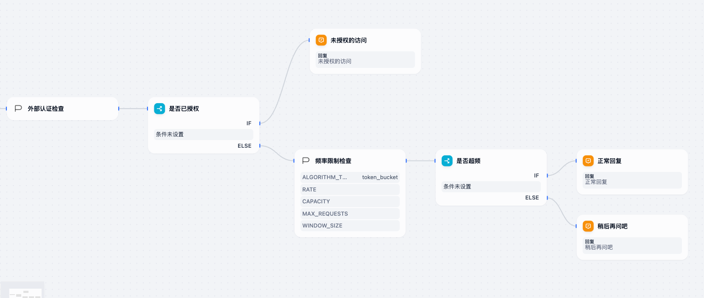

# 安全聊天插件

一个强大的Dify插件，为您的应用程序提供全面的安全性和访问控制功能。

## 功能特性

### 限流控制
- 多种限流算法支持：
  - 令牌桶算法
  - 固定窗口算法
  - 滑动窗口算法
  - 漏桶算法
  - 多桶混合限制

### 存储选项
- 灵活的存储后端：
  - Redis存储
  - Dify插件内置存储

### 用户认证
- 多维度用户识别：
  - 用户ID
  - 操作类型
  - 自定义参数

## 开发说明

1. 克隆仓库：
```bash
git clone https://github.com/axdlee/safety-chat.git
```

2. 安装依赖：
```bash
pip install -r requirements.txt
```

3. 配置环境：
```bash
cp .env.example .env
# 编辑.env文件配置您的设置
```

## 使用方法

### 步骤一：安装插件
在Dify应用市场中安装安全聊天插件。

### 步骤二：配置插件
在Dify应用中配置插件设置。


### 步骤三：设置限流
配置您偏好的限流算法和参数。




### 步骤四：配置外部认证


### 步骤五：定义访问规则
根据您的需求创建和管理访问控制规则。


## 许可证

MIT许可证

## 贡献指南

欢迎贡献代码！请随时提交Pull Request。

## 支持

如需支持，请在GitHub仓库中提交Issue。 